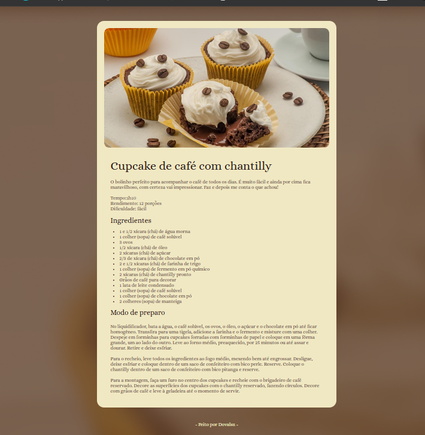

# Pagina de Receita

Uma pagina web simples e responsiva para apresentar uma receita de cupcake de cafe com chantilly.



## Sobre o projeto

Este projeto foi desenvolvido como um exercício de HTML e CSS pela rocketseat, com foco em uma apresentacao clara da receita, seus ingredientes e o modo de preparo.

## Tecnologias

- HTML5
- CSS3
- Google Fonts

## Como executar

1. Clone este repositorio:

   ```bash
   git clone git@github.com:dvlsz/IA-Git.git
   ```

2. Entre na pasta do projeto:

   ```bash
   cd rocketseat/projetos/pagina-de-receita
   ```

3. Abra o arquivo `index.html` no navegador.

Tambem e possivel usar uma extensao como o Live Server no VS Code para visualizar a pagina durante o desenvolvimento.

## Estrutura

```text
pagina-de-receita/
├── images/
│   ├── bg-image.png
│   └── main-image.png
|   └── previa-do-site.png
├── styles/
│   └── styles.css
├── index.html
└── README.md
```

## Autor

Desenvolvido por [Dovalsz](https://github.com/dvlsz).
